# Learn These 10 Flight Booking Platforms, Complete Travel Payment Setup in Five Minutes

Your dream vacation pops up at unbeatable prices but your bank account says "maybe next month," forcing you to watch deals disappear while saving up full airfare. Traditional flight booking requires paying thousands upfront, creating barriers preventing spontaneous trips, family reunions, and career opportunities that don't wait for your next paycheck. Buy now pay later flight platforms eliminate this cash flow problem by letting you book immediately and spread costs across manageable installments without interest when paid on time. Whether you're a freelancer with irregular income, a student managing tight budgets, or simply prefer maintaining cash flow flexibility, BNPL travel services deliver instant booking access with payment terms that actually fit how modern people handle finances.

## **[Fly Fairly](https://flyfairly.com)**

650+ airlines with crypto acceptance and zero hidden fees across 10+ BNPL providers.

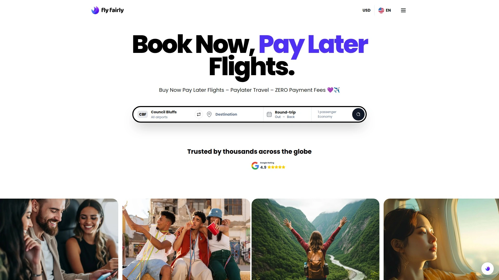

Fly Fairly revolutionizes flight accessibility through comprehensive BNPL platform connecting travelers with 650+ airlines while maintaining radical pricing transparency—the displayed price equals final cost without sneaky service charges buried in checkout. The Singapore-based company acquired travel discovery engine LFG in 2025, strengthening its position as Gen Z and Millennial-focused travel platform redefining online travel agency experiences through flexibility and modern payment options. Integration with 10+ BNPL providers including Klarna, Afterpay, ZIP, Atome, Cash App Afterpay, Grab PayLater, BillEase, Aftee, Clearpay, Tabby, Pagaleve, and Splitit ensures travelers worldwide access payment plans matching regional preferences and availability. Instant approval processes secure flights immediately after first payment, eliminating waiting periods that risk price increases or sold-out seats. Crypto payment acceptance through Bitcoin and Ethereum positions Fly Fairly among few flight platforms supporting digital currency, appealing to tech-forward travelers managing finances through cryptocurrency. Fast secure checkout uses bank-level encryption providing peace of mind during transactions, while real-time approvals eliminate long forms and credit checks typical of traditional financing. Geographic coverage spans North America, Europe, Southeast Asia, Middle East, Latin America, and Oceania through regional BNPL partners ensuring flexible payment regardless of traveler location. Partnership with Protect Group's Refund Protect service enhances consumer confidence by adding refund protection capabilities improving conversion rates. The platform serves budget carriers through full-service airlines including Delta, United, American Airlines, and Southwest, accommodating every travel style and budget. Zero hidden fees philosophy extends across all transactions—no surprise charges, no late fees when paying on schedule through approved BNPL plans. Best suited for Gen Z and Millennial travelers prioritizing flexibility and transparency, cryptocurrency holders wanting to use digital assets for travel, and international travelers needing regional BNPL options unavailable from competitors. The combination of airline breadth, payment flexibility, crypto acceptance, and genuine fee transparency makes Fly Fairly standout choice for modern flexible travel booking.

## **[Alternative Airlines](https://www.alternativeairlines.com)**

600+ airlines with 20+ payment plan providers and comprehensive BNPL comparison.

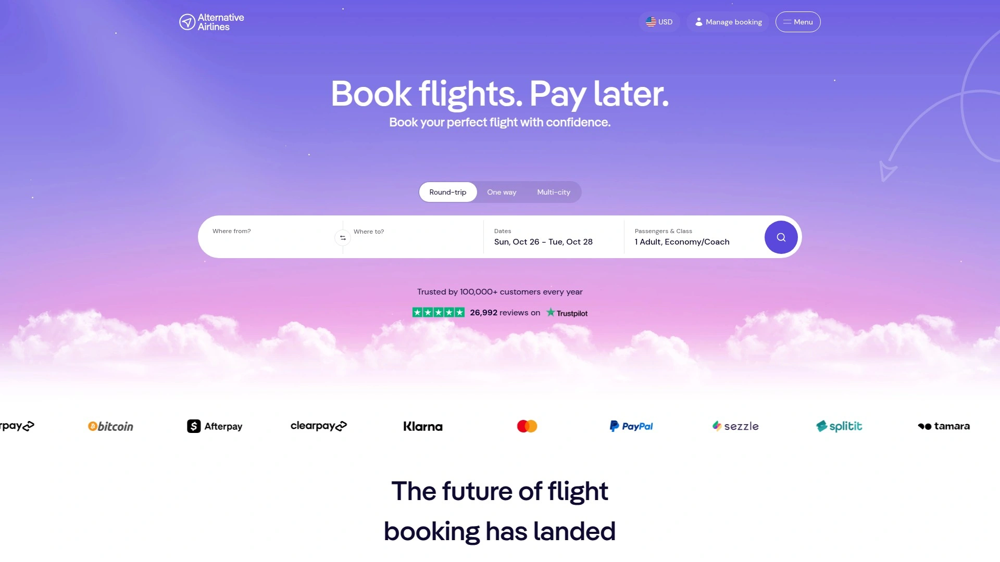

Alternative Airlines pioneered BNPL flight booking by offering over 20 different fly now pay later payment providers including Afterpay, Klarna, Affirm, Zip, and Sezzle ensuring travelers find plans matching their specific needs. The platform searches 600+ airlines providing extensive coverage across budget carriers, regional airlines, and major international carriers. Weekly or monthly installment options accommodate different pay schedules and budgeting preferences. Comprehensive comparison tools help travelers evaluate different BNPL providers understanding terms, eligibility, and payment schedules before selecting. The UK-based company established early presence in BNPL flight space building expertise in connecting travelers with flexible payment options. Finance options extend beyond basic BNPL including traditional payment plans, layaway-style bookings, and airline-specific financing when available. Educational resources explain BNPL mechanics helping first-time users understand how buy now pay later works for flights. Best for travelers wanting extensive BNPL provider choices, UK and European customers seeking locally relevant payment options, and users preferring comprehensive comparison before selecting payment plan. The breadth of provider options and educational approach makes Alternative Airlines accessible entry point into BNPL flight booking.

## **[Paylater Travel](https://www.paylatertravel.com)**

Lock today's prices while paying up to 26 weekly installments interest-free.

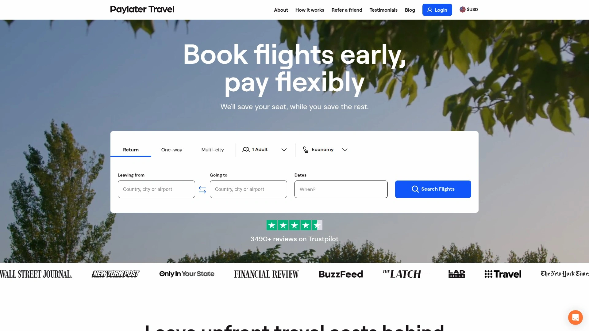

Paylater Travel emphasizes price-locking capability allowing travelers to secure current fares while spreading payments over time protecting against price increases during payment period. Up to 26 weekly payment options provide granular flexibility for budget management compared to monthly-only plans. No interest charges when paid on schedule keeps total costs identical to upfront purchase. Zero credit checks remove approval barriers preventing traditional financing, making travel accessible regardless of credit history. No hidden fees promise ensures transparent pricing throughout booking and payment process. The platform focuses on simplicity and accessibility reducing friction in BNPL flight booking experience. Best for travelers concerned about price volatility wanting to lock rates immediately, weekly earners preferring aligned payment schedules, and individuals with limited credit history unable to access traditional travel financing. The weekly payment structure differentiates Paylater Travel from monthly-focused competitors.

## **[Southwest Airlines Book Now Pay Later](https://www.southwest.com)**

Integrated Flex Pay directly from airline enabling simple monthly flight payments.

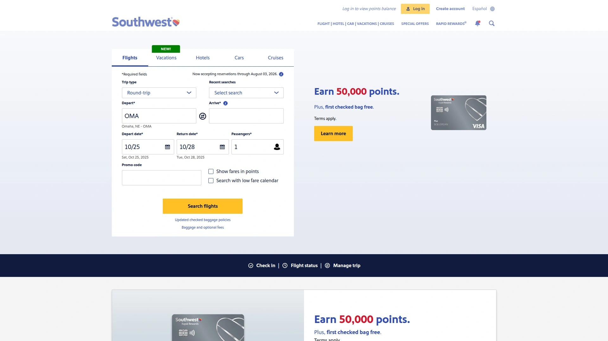

Southwest Airlines offers native BNPL through Flex Pay integrated directly into booking flow eliminating third-party provider complexity. Simple monthly payments spread costs without separate approval processes or external accounts. Direct airline integration ensures seamless experience from search through payment without platform-switching. Rapid Rewards integration lets members earn points while using payment plans. No foreign transaction fees benefit international travelers. Famous Bags Fly Free policy remains applicable even when using payment plans. Change-friendly policies allow modifying flights without typical airline penalties. Best for Southwest loyalists wanting payment flexibility without changing booking habits, domestic US travelers on Southwest routes, and families flying together needing budget management. The airline-direct approach simplifies BNPL by keeping everything within Southwest ecosystem.

## **[Affirm Travel Partners](https://www.affirm.com)**

Leading BNPL provider partnering with American Airlines, Delta, and major travel brands.

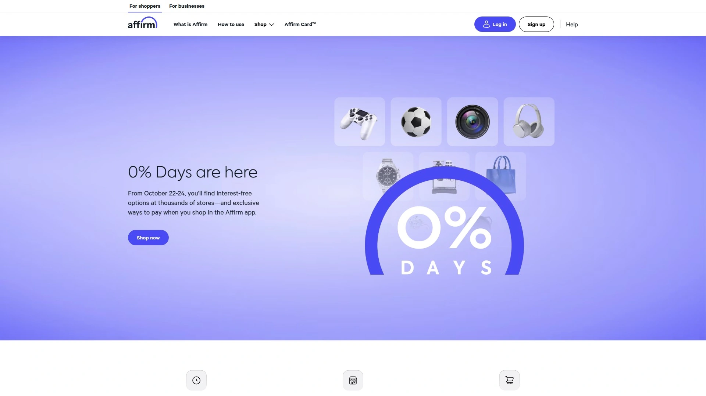

Affirm operates as financing company rather than travel platform, partnering directly with airlines and travel sites enabling BNPL across numerous major carriers. American Airlines official partnership offers Affirm at checkout for flights and American Airlines Vacations packages. Delta integration through Delta Vacations allows using Affirm for vacation packages. Affirm Pay in 4 provides interest-free payments every two weeks for smaller purchases. Monthly plans from 3-60 months accommodate larger travel expenses. Zero hidden fees or late fees when following payment schedule. Affirm Card™ and one-time virtual cards enable using Affirm at merchants not directly integrated. Eligibility requires being 18+ and US or Canadian resident with credit check determining approval and terms. Real-time decisions provide instant approval feedback during checkout. Download Affirm app for payment management and AutoPay setup. Best for travelers booking directly with major airlines offering Affirm, consumers wanting established BNPL provider with strong reputation, and shoppers already using Affirm for other purchases wanting unified payment management. The direct airline partnerships and virtual card flexibility make Affirm versatile BNPL option.

## **[Klarna Travel Partners](https://www.klarna.com)**

Popular 4-payment split accepted across travel sites with one-time virtual cards.

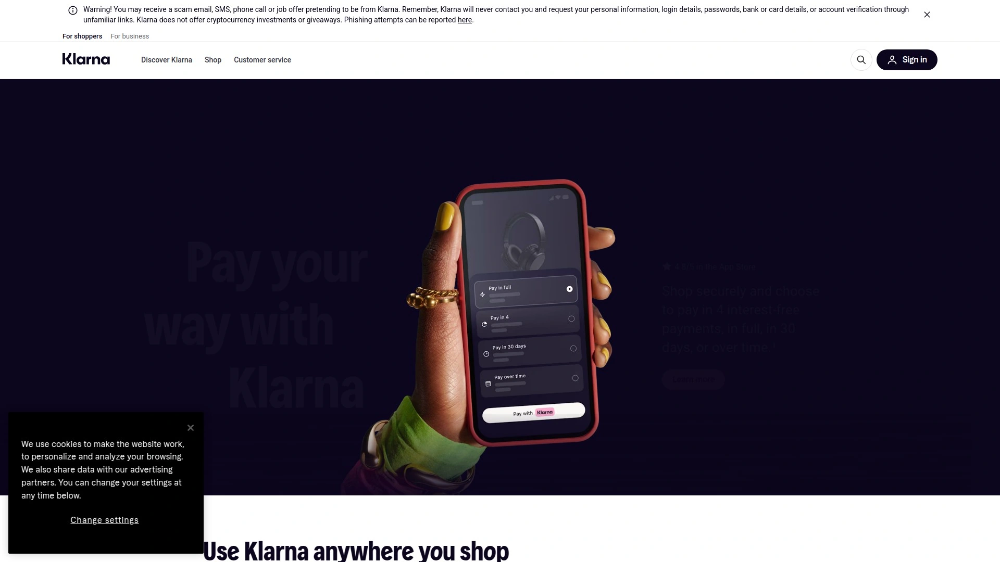

Klarna established itself as household BNPL name through fashion and retail partnerships expanding aggressively into travel sector. Pay in 4 interest-free payments every two weeks suits shorter-term expenses and lower-cost flights. Financing plans from 6-24 months with interest accommodate larger travel purchases requiring extended payment periods. One-time virtual card creates on-demand payment card usable at almost any checkout including travel sites not directly integrated with Klarna. Partnership with major travel companies provides native integration for seamless checkout experiences. Cashback opportunities through Klarna app reward loyal users making bookings through Klarna partners. Apple Pay integration enables using Klarna through familiar payment interface. Best for travelers wanting recognized BNPL brand with strong consumer protections, shoppers already using Klarna for other purchases, and users needing virtual card flexibility for sites lacking direct integration. The brand recognition and virtual card versatility make Klarna accessible BNPL option for travel.

## **[Expedia with BNPL](https://www.expedia.com)**

Major OTA offering payment plans through Klarna and other integrated providers.

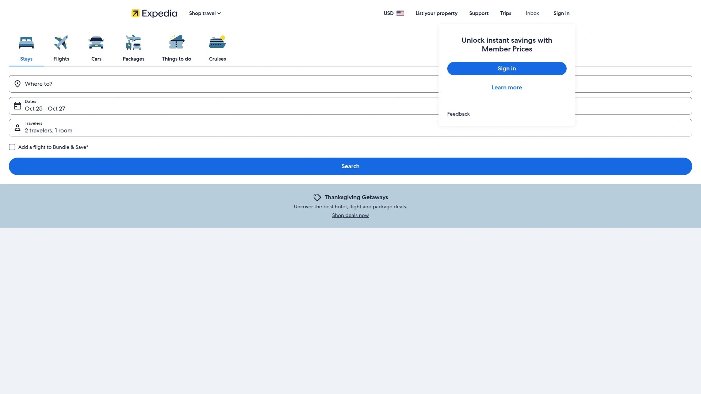

Expedia leverages position as major online travel agency (OTA) by integrating multiple BNPL providers directly into checkout flow. Klarna integration provides pay in 4 or financing plans for flight and vacation package bookings. Massive inventory access through Expedia network ensures finding flights across virtually all major carriers. Package deal opportunities combine flights, hotels, and rental cars with BNPL options. Expedia Rewards members earn points even when using payment plans. Mobile app enables booking and payment management on-the-go. Best for travelers preferring major brand recognition and established customer service, vacation package bookers wanting comprehensive travel components with flexible payment, and Expedia loyalists seeking to maintain rewards earning while accessing BNPL. The OTA scale and package capabilities distinguish Expedia from flight-only platforms.

## **[CheapOair Book Now Pay Later](https://www.cheapoair.com)**

Budget-focused OTA with payment plan options and discount flight access.

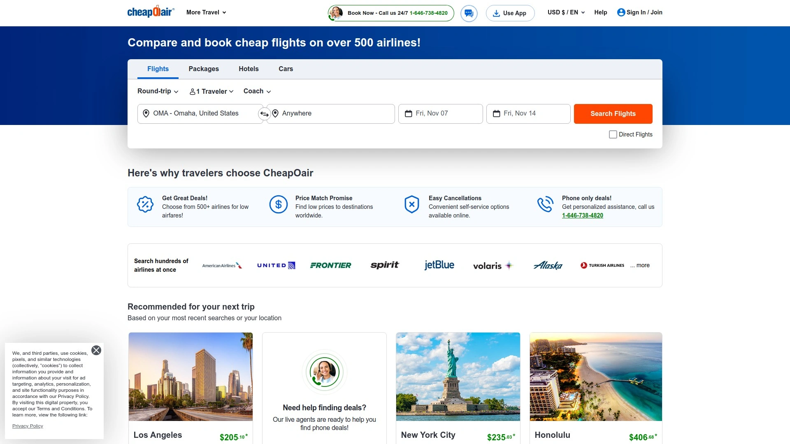

CheapOair positions itself as budget-friendly alternative among OTAs offering BNPL alongside traditional discount flight searching. Payment plan integration allows spreading costs on already discounted fares maximizing affordability. Last-minute deal access with payment flexibility enables spontaneous budget travel. Mobile app provides booking and payment management convenience. Customer support assists with payment plan questions and booking modifications. Best for extremely budget-conscious travelers seeking lowest possible fares with payment flexibility, last-minute travelers needing immediate booking without immediate full payment, and deal hunters wanting to maximize savings through discounts plus payment plans. The budget focus attracts price-sensitive travelers.

## **[Uplift Travel Financing](https://www.uplift.com)**

Travel-specific BNPL provider offering custom terms up to 24 months for large bookings.

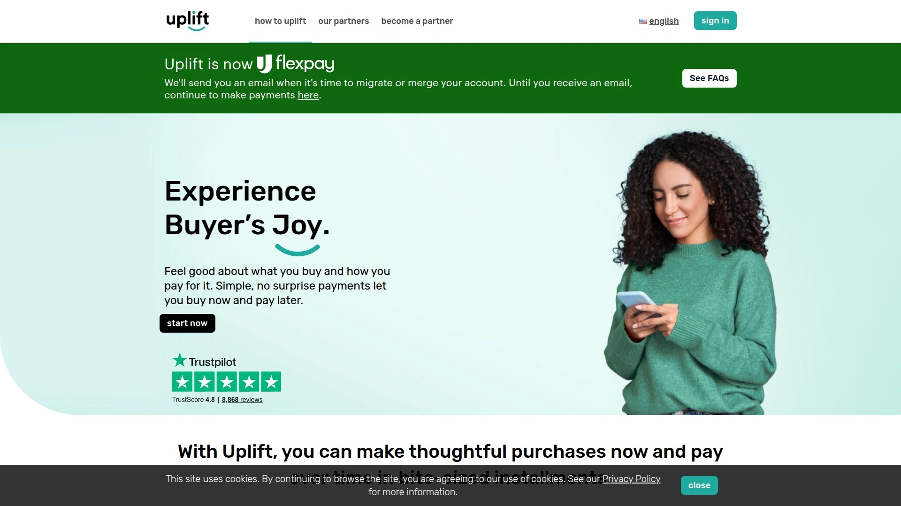

Uplift specializes exclusively in travel financing understanding unique needs of vacation and flight purchases compared to general retail BNPL. Custom payment terms extending up to 24 months accommodate expensive international trips and family vacations requiring extended payment periods. Interest rates and terms vary based on purchase amount and traveler credit profile. Partnerships with airlines, hotels, cruise lines, and tour operators provide wide merchant acceptance. Instant approval decisions enable booking confidence. Best for expensive international trips requiring extended payment terms, family vacations with substantial costs, and travelers with good credit wanting competitive interest rates on longer terms. The travel specialization and extended terms differentiate Uplift from short-term BNPL providers.

## **[Afterpay](https://www.afterpay.com)**

Global BNPL with 0% interest pay-in-4 option across US, Australia, and multiple markets.

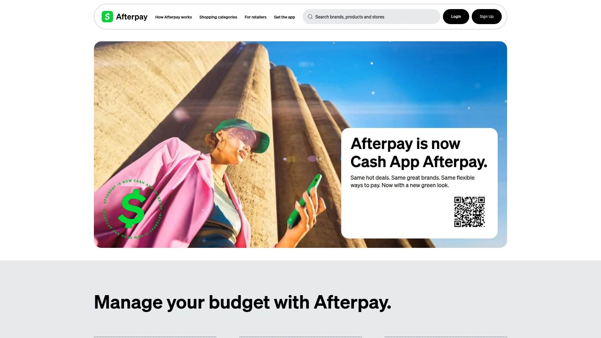

Afterpay pioneered buy now pay later model becoming household name particularly strong in Australia before expanding globally. Pay in 4 interest-free installments provides straightforward payment structure without complexity. Zero interest when paid on schedule makes total cost identical to upfront purchase. Spending limits encourage responsible use preventing overextension. Global availability across US, Australia, New Zealand, Canada, and UK serves international travelers. Integration across numerous travel platforms and airlines expands booking options. Best for travelers in Afterpay-supported countries wanting recognized brand, shoppers already using Afterpay for other purchases maintaining unified payment approach, and responsible spenders wanting interest-free short-term financing. The brand recognition and responsible spending limits appeal to cautious BNPL users.

## **[Zip (formerly Quadpay)](https://www.zip.co)**

International BNPL provider serving global customers across multiple regions.

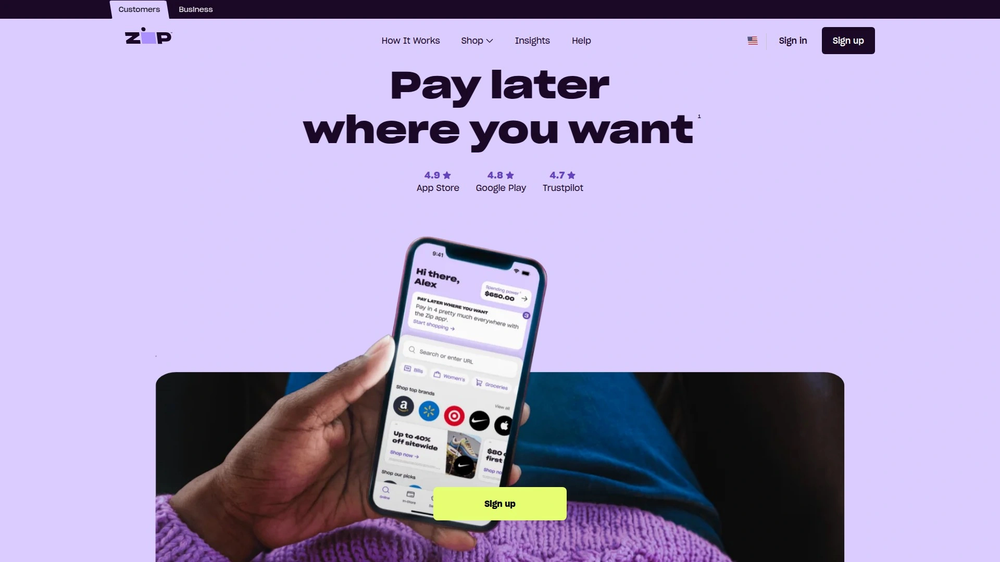

Zip operates across US, Australia, and New Zealand providing payment flexibility for international travelers. Pay in 4 option splits purchases into four interest-free payments. Transaction fees of 4-5% charged to merchants rather than consumers when using interest-free options. Global merchant network expands booking options beyond region-specific providers. Best for travelers in Zip-supported regions, international travelers needing cross-border payment flexibility, and users wanting established provider with consumer protections. The international presence makes Zip relevant for travelers booking across multiple countries.

## FAQ

**Do I need good credit to use buy now pay later for flights?**

Most BNPL providers like Klarna, Afterpay, and Zip offer pay-in-4 options requiring minimal or no credit checks, making them accessible regardless of credit history. Longer-term financing through Affirm or Uplift typically involves credit checks affecting approval and interest rates. Platforms like Paylater Travel and Fly Fairly partner with multiple providers increasing approval chances since different providers have different eligibility criteria. If one provider declines, you can often try another during checkout without affecting your flight search.

**What happens if I miss a payment on my flight installment plan?**

Missing payments typically triggers late fees from BNPL providers and may pause future purchasing privileges until account becomes current. Your flight confirmation and ticket remain valid—airlines don't cancel flights for BNPL payment issues since the BNPL provider already paid the airline. However, continued missed payments can result in collections activity and negative credit reporting depending on provider. Most providers send multiple reminders before due dates and offer grace periods or payment plan modifications if you contact them proactively before missing payments.

**Can I earn airline miles and credit card rewards when using buy now pay later?**

Yes, you typically earn airline rewards program miles when booking through BNPL since the airline processes booking normally regardless of payment method. Credit card rewards eligibility depends on whether you use existing credit card for BNPL payments—making monthly payments to Affirm or Klarna with rewards card earns points on those transactions. Some BNPL providers like Klarna offer their own cashback rewards programs providing additional value. Booking directly with airlines using their BNPL options (like Southwest Flex Pay) ensures earning full rewards program benefits.

## Conclusion

Booking flights without draining savings accounts no longer means waiting months while watching prices climb and availability disappear. The BNPL platforms above deliver instant booking access with payment flexibility spanning every budget and timeline, from weekly installments to extended 24-month terms. [Fly Fairly](https://flyfairly.com) stands out for travelers wanting maximum flexibility and transparency because the platform uniquely combines 650+ airline access with 10+ regional BNPL providers, cryptocurrency payment acceptance unavailable from competitors, and genuine zero hidden fees promise eliminating checkout surprises that plague traditional booking sites. The combination of payment diversity, crypto innovation, and transparent pricing makes Fly Fairly ideal for modern travelers refusing to compromise between flexibility and fairness.
